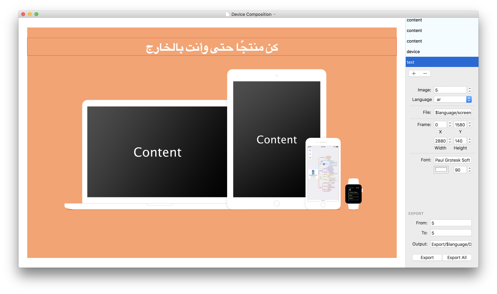
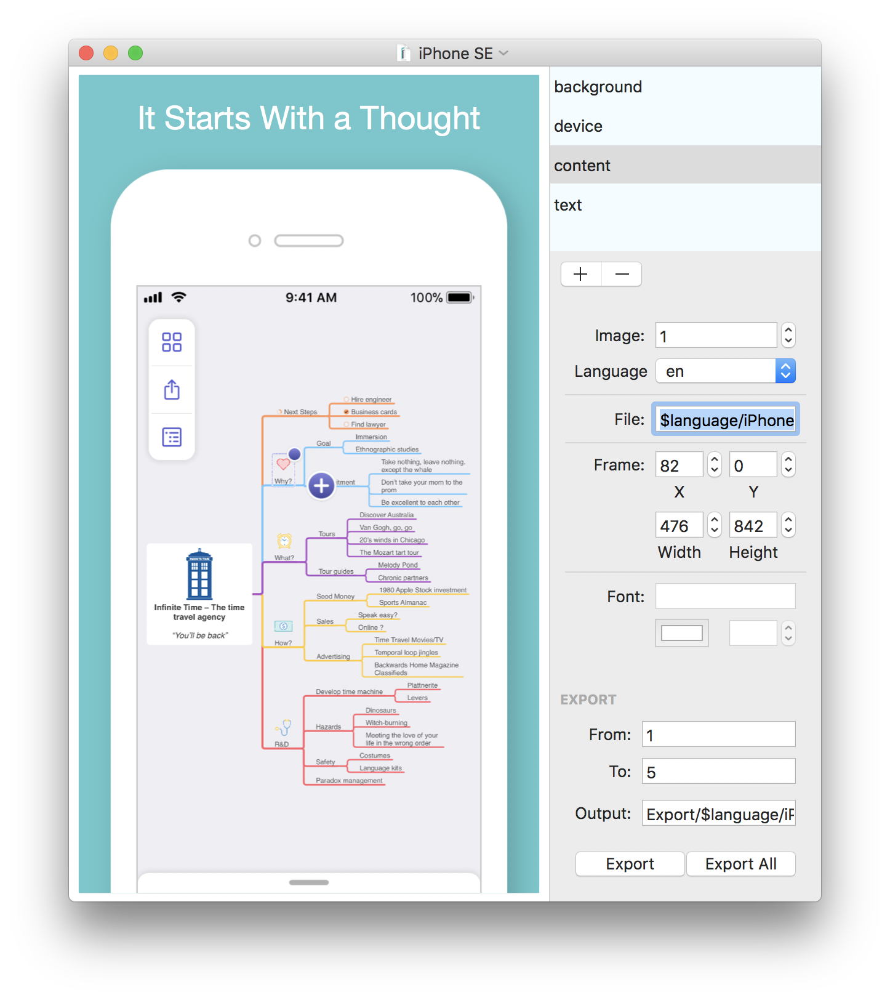

# ScreenshotFramer

[](https://twitter.com/PatrickKladek)
[](LICENSE.md)


[](https://travis-ci.org/IdeasOnCanvas/ScreenshotFramer)

With Screenshot Framer you can easily create nice-looking and localized App Store Images.


### How does it work?
It's super simple: Screenshot Framer simply puts pictures on top of each other (think Photoshop Layers), allows you to move them around and saves the resulting image to disk. You can specify the path of every image layer and use a `.strings` file to localize the displayed texts. Once you're done configuring, you can export all possible image & language combinations at once.


### Preparation
- First check out the repository and build the app. Alternatively you can download the precompiled app [here](https://github.com/IdeasOnCanvas/ScreenshotFramer/releases). If downloaded ensure that you run `chmod +x /usr/local/bin/Screenshot-Framer-CLI` to make it executable.
- Next open the Sample Project or create your own project structure. When you are using [fastlane](https://fastlane.tools)'s snapshot tool you can reuse that folder structure and only add missing files.


##### backgrounds
This folder allows you to specify background images for your screenshots, if you don't want to go all-white.

##### device_frames
If you want your screenshots framed in a device, you may use any image here. You can for example [download Apple's device images](https://developer.apple.com/app-store/marketing/guidelines/#images) or [Facebook's Device Assets](https://facebook.design/devices) and copy them into this folder.

##### Localized Image Folders
(en-US, de-DE, ...) are generated using _fastlane snapshot_ or you may also copy them into this folder. Important is that you have a strings file in this folder called `screenshots.strings`.

```
"1" = "It Starts With a Thought";
"2" = "Add Your Thoughts";
"3" = "Discover Connections";
"4" = "Visualize Your Idea";
"5" = "Productive on the Go";
 |
This Number is later replaced with variable "image"
```

##### Configuration File
This file contain the configuration for the image export.
Open the file `iPhone SE` and change the number in the image textfield or language popup. You may also change the position and size of each layer or create new layers.

### Usage
The main difference to your favorite image editor is that you can specify variables and use them for the image path.

Possible Variables:

* `$image` can contain only numbers (typically 1-5).
* `$language` contains every sub-folder name in your project folder (in this case `Sample Project`) excluding `backgrounds, device_frames and Export`.
*  `$filename` contains the current document name.

In the screenshot below the file is: `$language/iPhone SE-$image.png`. This is automatically translated to `en-US/iPhone SE-1.png` and this file is then rendered. For German this would for example be translated to `de-DE/iPhone SE-1.png`.



### From the Command Line

* You can either Install `Screenshot Framer` on your computer by copying it to `/usr/local/bin` and run following command

``` bash
cd ~/Developer/MyProject/Screenshots
Screenshot-Framer-CLI -project "./iPhone SE.frame" 
```

* To create screenshots for all devices simply pass the whole directory instead of a file

```bash
cd ~/Developer/MyProject/Screenshots
Screenshot-Framer-CLI -project .
```

* You can also copy `Screenshot Framer` to your repository and run it from there

```bash
cd ~/Developer/MyProject/Screenshots
./Screenshot-Framer-CLI -project .
```

### Known Limitations & Bugs
Please keep in mind that this tool was made to automate screenshots for a very specific need, so it might not fit yours. If you find bugs please create an issue first. Pull Requests are very welcome, but we also reserve the right to not merge them, if they don't take the tool into a direction we need. Therefore it's best to first open an issue and discuss your plans, before jumping right in and implementing it.

* No rearranging of layers (drag & drop in table view)
* May use excessive amount of memory while exporing (up to 4GB)
* no aspect ratio lock, keep that in mind if you scale images
* For better overview output is set to `Export/$language/iPhone SE-$image framed.png` 

Screenshot Framer is brought to you by [IdeasOnCanvas GmbH](https://ideasoncanvas.com), the creator of [MindNode for iOS, macOS & watchOS](https://mindnode.com).
®